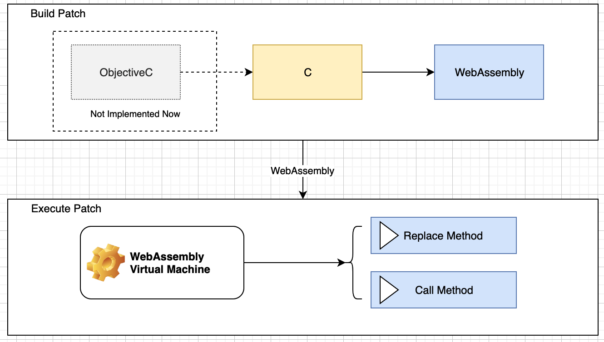

# WasmPatch
*Yet Another Patch Module for iOS/macOS via WebAssembly*

[](https://github.com/everettjf/WasmPatch/issues)
[](https://github.com/everettjf/WasmPatch/blob/master/LICENSE)
[](https://twitter.com/everettjf)

WasmPatch bridges Objective-C and WebAssembly: it compiles C code into WebAssembly modules and lets those modules call any Objective-C class or method dynamically. This gives apps the ability to hot-fix bugs or add features by patching Objective-C code through WebAssembly payloads.

> **Status:** WasmPatch is currently a demo and under active development—contributions and experiments are welcome.

## Table of Contents
- [Features](#features)
- [How It Works](#how-it-works)
- [Environment & Requirements](#environment--requirements)
- [Quick Start](#quick-start)
- [Installation](#installation)
- [Usage](#usage)
- [Configuration](#configuration)
- [Examples](#examples)
- [Development](#development)
- [Community](#community)
- [Contributing](#contributing)
- [Security](#security)
- [License](#license)
- [Acknowledgements](#acknowledgements)
- [Star History](#star-history)

## Features
- Compile C code to WebAssembly with `clang`/LLVM and ship the wasm payload with your app.
- Dynamically invoke any Objective-C class or instance method from WebAssembly (e.g., `call_class_method_*`, `call_instance_method_*` helpers).
- Replace Objective-C methods on the fly (class and instance) to hot-fix behavior without shipping a new binary.
- Works on both iOS and macOS, with demo workspaces for each platform.
- Ships ready-to-use tooling (`Tool/c2wasm.sh`, `TestCase/compile-testcase.sh`) and sample wasm scripts so you can experiment immediately.

## How It Works


WasmPatch compiles your patch logic from C into WebAssembly, loads the wasm module inside the host app, and exposes runtime APIs so WebAssembly code can call into Objective-C classes, instances, and selectors. Method replacement APIs let you intercept Objective-C implementations and redirect them to WebAssembly-defined functions, turning WebAssembly into a powerful hotfix system.

- 中文介绍：请关注微信订阅号，搜索「WasmPatch探索之路」文章。


## Environment & Requirements
- Platforms: iOS 10.0+ and macOS 10.14+ (per `WasmPatch.podspec`).
- Architectures tested: `arm64`, `arm64e`, `x86_64`; expected to work on `armv7`, `armv7s`, `i386`.
- Toolchain: `clang`/LLVM with WebAssembly target plus `wasm2wat` (install via `brew install llvm` or `sh Tool/install-llvm.sh`).
- Language standard: C++17 (`CLANG_CXX_LANGUAGE_STANDARD` with `libc++`).

## Quick Start
1. **Install LLVM / clang** (one-time requirement).
   ```sh
   brew update
   brew install llvm
   # or
   sh Tool/install-llvm.sh
   ```
2. **Build the sample patch.**
   ```sh
   cd TestCase
   sh compile-testcase.sh   # calls Tool/c2wasm.sh internally
   ```
3. **Install demo dependencies.**
   ```sh
   cd Demo
   sh podinstall_all.sh
   ```
4. **Run the demos.**
   - iOS: open `Demo/WasmPatch-iOS/WasmPatch-iOS.xcworkspace`.
   - macOS: open `Demo/WasmPatch-macOS/WasmPatch-macOS.xcworkspace`.

## Installation
### CocoaPods
```ruby
# local pod
pod 'WasmPatch', :path => '../../'

# online pod
pod 'WasmPatch'
```

### Manual Integration
Drag the `WasmPatch` directory into your Xcode project and add `WasmPatch/Classes/wap/depend/libffi/include` to the target's **Header Search Paths**.

## Usage
### Build C into WebAssembly
Install LLVM via Homebrew (or run `Tool/install-llvm.sh`), then build your C file into WebAssembly:
```sh
brew update
brew install llvm
```

### Build Patch Artifacts
Use the provided script to compile patches:
```sh
./Tool/c2wasm.sh input.c output.wasm
```
`Tool/c2wasm.sh` invokes `clang` with WebAssembly flags, produces `<output>.wasm`, and exports `<output>.wasm.wat` via `wasm2wat` for inspection. The sample script `TestCase/compile-testcase.sh` compiles `TestCase/WasmPatch-TestCase/Assets/script.bundle/objc.c` by calling `Tool/c2wasm.sh`.

### Load Patch at Runtime
```objective-c
// header file
#import <WasmPatch/WasmPatch.h>

// call wap_load_file to load wasm file
NSString *scriptPath = [scriptBundlePath stringByAppendingPathComponent:@"objc.wasm"];
bool result = wap_load_file(scriptPath.UTF8String);
if (!result) {
    NSLog(@"failed load file %@", scriptPath);
    return;
}
```

## Configuration
- Ship your wasm in a bundle (e.g., `script.bundle/objc.wasm`) and point `wap_load_file` to that path at runtime.
- Manual integrations must add `WasmPatch/Classes/wap/depend/libffi/include` to the Header Search Path and link against `libc++`.
- Ensure the project (or Pod) compiles with C++17 (`CLANG_CXX_LANGUAGE_STANDARD = c++17`, `CLANG_CXX_LIBRARY = libc++`) as defined in `WasmPatch.podspec`.

## Examples
Example patch source: [View source directly](https://github.com/everettjf/WasmPatch/blob/master/TestCase/WasmPatch-TestCase/Assets/script.bundle/objc.c).

### Call Methods
```c
// method call - class method
call_class_method_0("CallMe", "sayHi");

WAPObject word = new_objc_nsstring("I am from c program");
call_class_method_1("CallMe", "sayWord:", word);
dealloc_object(word);

// method call - instance method
WAPObject call = alloc_objc_class("CallMe");
call_instance_method_0(call,"sayHi");
dealloc_object(call);

WAPObject call1 = alloc_objc_class("CallMe");
word = new_objc_nsstring("I am from c program");
call_instance_method_1(call1,"sayWord:", word);
dealloc_object(word);
dealloc_object(call1);
```

### Replace Methods
```c
int my_class_ReplaceMe_request(WAPObject self, const char * cmd) {
    print_string("replaced + ReplaceMe request");
    return 0;
}

int my_class_ReplaceMe_requestfromto(WAPObject self, const char * cmd, WAPArray parameters) {
    print_string("replaced + ReplaceMe requestFrom:Two to:One");
    return 0;
}
int my_instance_ReplaceMe_request(WAPObject self, const char * cmd) {
    print_string("replaced - ReplaceMe request");
    return 0;
}

int my_instance_ReplaceMe_requestfromto(WAPObject self, const char * cmd, WAPArray parameters) {
    print_string("replaced - ReplaceMe requestFrom:Two to:One");
    return 0;
}

int entry() {
    // method replace
    replace_class_method("ReplaceMe", "request", "my_class_ReplaceMe_request");
    replace_class_method("ReplaceMe", "requestFrom:to:", "my_class_ReplaceMe_requestfromto");

    replace_instance_method("ReplaceMe", "request", "my_instance_ReplaceMe_request");
    replace_instance_method("ReplaceMe", "requestFrom:to:", "my_instance_ReplaceMe_requestfromto");
}
```

### Call with Many Arguments
```c
// many arguments
WAPArray params = alloc_array();
append_array(params, alloc_int32(10));
append_array(params, alloc_int64(666));
append_array(params, alloc_float(7.77));
append_array(params, alloc_double(200.2222));
append_array(params, new_objc_nsstring("excellent"));
append_array(params, alloc_string("WebAssembly"));
call_class_method_param("CallMe", "callWithManyArguments:p1:p2:p3:p4:p5:", params);
dealloc_array(params);
```

## Development
- Install LLVM toolchain: `sh Tool/install-llvm.sh`.
- Convert C patches to WebAssembly: `./Tool/c2wasm.sh input.c output.wasm`.
- Build the reference patch: `cd TestCase && sh compile-testcase.sh`.
- Install demo dependencies: `cd Demo && sh podinstall_all.sh`.
- Run the iOS demo via `Demo/WasmPatch-iOS/WasmPatch-iOS.xcworkspace` or the macOS demo via `Demo/WasmPatch-macOS/WasmPatch-macOS.xcworkspace`.
- Inspect generated `.wasm` and `.wat` artifacts to debug exported functions.

## Community
- Twitter: [@everettjf](https://twitter.com/everettjf)

Wish you enjoy :)

## Contributing
Have ideas or fixes? Open an issue or pull request on GitHub. The project is still evolving, so even small suggestions—documentation, demos, or tooling—are appreciated.

## Security
Report potential vulnerabilities privately via [GitHub issues](https://github.com/everettjf/WasmPatch/issues) or email the maintainer at `everettjf@live.com`. Please avoid opening public exploits until a fix is coordinated.

## License
Distributed under the [MIT License](LICENSE).

## Acknowledgements
- [wasm3](https://github.com/wasm3/wasm3)
- [libffi](https://github.com/libffi/libffi)
- [JSPatch](https://github.com/bang590/JSPatch)

## Star History
[](https://star-history.com/#everettjf/WasmPatch&Date)
