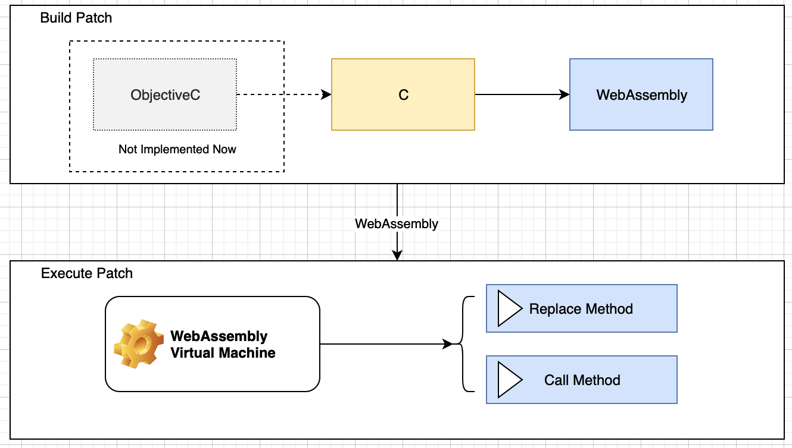
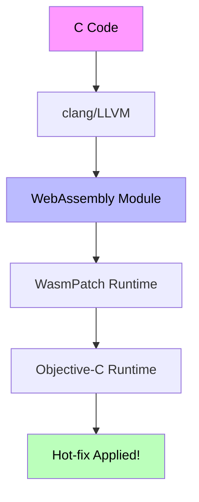

# WasmPatch 🧱

<div align="center">

[](https://github.com/everettjf/WasmPatch/stargazers)
[](https://github.com/everettjf/WasmPatch/network)
[](LICENSE)
[](https://github.com/everettjf/WasmPatch/issues)

**WebAssembly-driven hot patching for iOS/macOS Objective-C apps**

[English](README.md)

</div>

> Hot-fix iOS/macOS apps using WebAssembly payloads. Compile C code to WASM and replace Objective-C methods at runtime.

---

## 🎯 What is WasmPatch?

WasmPatch bridges **Objective-C** and **WebAssembly**. It compiles C code into WebAssembly modules and lets those modules call any Objective-C class or method dynamically.

This gives apps the ability to:
- 🔧 **Hot-fix bugs** without shipping a new binary
- ✨ **Add features** via WebAssembly payloads
- 🔄 **Replace methods** at runtime (class and instance)



---

## ✨ Features

| Feature | Description |
|---------|-------------|
| 🧱 **WASM Compilation** | Compile C code to WebAssembly with `clang`/LLVM |
| 🔗 **Objective-C Bridge** | Call any Obj-C class or method from WebAssembly |
| 🔄 **Method Replacement** | Hot-fix by replacing Obj-C methods at runtime |
| 🍎 **Cross-Platform** | Works on both iOS and macOS |
| 📐 **Struct Bridging** | Pass/return `CGPoint`/`CGSize`/`CGRect`/`NSRange` by value |
| ✍️ **Author Ergonomics** | `WAP_REPLACE_*` macros (typos fail to compile), scope cleanup pools, `call_*_3/4` |
| 🛠️ **Runtime Diagnostics** | Host log handler, strict-hook policy, structured load/runtime errors |
| 📦 **SPM + CocoaPods** | Swift Package Manager and CocoaPods integration |
| 🧩 **Block Callbacks** | Invoke received blocks (`invoke_block`) and create blocks to pass into Obj-C (`create_block`) |
| 🦅 **Swift Support** | `@objc dynamic` hooking + hookable-surface scanner — see [SWIFT.md](SWIFT.md) |
| 🌐 **Remote Delivery** | `WAPPatchManager` — fetch, SHA-256 verify, cache, apply |
| 🔐 **Patch Signing** | EC P-256 / ECDSA signature verification before load (`Tool/wasmpatch sign`) |
| 🧪 **Regression Assets** | Test case bundle and fixture hosts for bridge validation |

---

## 🏗️ How It Works


```mermaid
graph TD
    A[C Code] --> B[clang/LLVM]
    B --> C[WebAssembly Module]
    C --> D[WasmPatch Runtime]
    D --> E[Objective-C Runtime]
    E --> F[Hot-fix Applied!]
    
    style A fill:#f9f,color:#000
    style C fill:#bbf,color:#000
    style F fill:#bfb,color:#000
```

1. **Write** your patch logic in C
2. **Compile** to WebAssembly using `clang`/LLVM
3. **Load** the wasm module in your app
4. **Call** Objective-C classes/methods from WebAssembly
5. **Replace** methods on the fly

---

## 🚀 Quick Start

### Prerequisites

```bash
# Install LLVM with WebAssembly target
brew install llvm

# Or use the provided script
sh Tool/install-llvm.sh
```

### 1. Clone and Setup

```bash
git clone https://github.com/everettjf/WasmPatch.git
cd WasmPatch
```

**Integrate into your app** via Swift Package Manager:

```swift
// Package.swift
.package(url: "https://github.com/everettjf/WasmPatch.git", branch: "master")
```

or CocoaPods (`pod 'WasmPatch'`). Swift apps: see [SWIFT.md](SWIFT.md) for what
`@objc dynamic` methods can be hooked and how value/struct types bridge.

### 2. Compile a Patch

```bash
# Check the toolchain is ready (clang wasm target, wasm-ld, SDK header)
Tool/wasmpatch doctor

# Compile a patch — the author SDK header <wasmpatch.h> is on the include path
# automatically, and a .sha256 + .meta.json are emitted next to the .wasm.
Tool/wasmpatch build your_patch.c
Tool/wasmpatch build your_patch.c build/your_patch.wasm

# (the older entry point still works)
sh Tool/build-patch.sh your_patch.c
```

Patch sources just `#include <wasmpatch.h>` and use the ergonomic macros:

```c
#include <wasmpatch.h>

WAPObject my_token(WAPObject self, const char *cmd) {
    return new_objc_nsstring("patched");
}

int entry() {
    // Registered name is derived from the real symbol — a typo won't compile.
    WAP_REPLACE_CLASS(MyClass, "token", my_token);

    WAP_POOL_BEGIN(pool);                       // scope-based cleanup
    WAPObject s = WAP_KEEP(pool, new_objc_nsstring("hi"));
    call_class_method_1("Logger", "log:", s);
    WAP_POOL_END(pool);                         // frees everything kept
    return 0;
}
```

### 3. Load in Your App

```objc
#import <WasmPatch/WAPPatchLoader.h>

NSError *error = nil;
WAPPatchLoaderOptions *options = [WAPPatchLoader recommendedOptions];
options.expectedSHA256Hex = @"<optional sha256>";

BOOL success = [WAPPatchLoader loadPatchNamed:@"your_patch"
                                     inBundle:NSBundle.mainBundle
                                      options:options
                                        error:&error];

if (!success) {
    NSLog(@"load failed: %@", error.localizedDescription);
    NSLog(@"runtime detail: %@", error.userInfo[WAPPatchLoaderRuntimeMessageKey]);
}
```

Low-level C API is still available when you need it:

```objc
#import <WasmPatch/WasmPatch.h>

BOOL success = wap_load_file("your_patch.wasm");
if (success) {
    NSLog(@"loaded");
} else {
    NSLog(@"load failed: %s", wap_last_error());
}
```

---

## 📁 Project Structure

```
WasmPatch/
├── WasmPatch/              # Core framework
│   ├── WasmPatch.h         # Public C API
│   ├── core/runtime/       # WASM runtime and exports
│   └── core/method/        # Obj-C method bridge and hooks
├── Tool/                   # Build tools
│   ├── c2wasm.sh           # C to WASM compiler
│   └── install-llvm.sh     # LLVM installer
├── TestCase/               # Test cases
│   ├── compile-testcase.sh # Test compiler
│   └── WasmPatch-TestCase/ # Sample host classes and wasm fixtures
├── Image/                  # Documentation images
├── Demo/                   # Demo projects
│   ├── iOS/               # iOS demo
│   └── macOS/             # macOS demo
└── README.md
```

---

## 💻 Examples

### Public Runtime API

```objc
bool wap_load_file(const char * path);
bool wap_load_data(const void * bytes, unsigned int size);
void wap_reset_runtime(void);
bool wap_runtime_is_loaded(void);
const char * wap_last_error(void);
```

### High-Level Objective-C API

```objc
NSError *error = nil;
WAPPatchLoaderOptions *options = [WAPPatchLoader recommendedOptions];
options.allowReload = YES;
options.resetBeforeLoad = YES;

[WAPPatchLoader loadPatchAtPath:path options:options error:&error];
[WAPPatchLoader loadPatchNamed:@"objc" inBundle:bundle options:options error:&error];
[WAPPatchLoader loadPatchData:data options:options error:&error];
[WAPPatchLoader reset];
```

Error handling:

```objc
if (error.code == WAPPatchLoaderErrorCodeSHA256Mismatch) {
    NSLog(@"patch tampered: %@", error.userInfo[WAPPatchLoaderRuntimeMessageKey]);
}
```

### Call Objective-C from WASM

```c
// advanced_patch.c
#include <wasmpatch.h>

int entry() {
    WAPObject message = new_objc_nsstring("WasmPatch detected request");
    call_class_method_1("NetworkManager", "logRequest:", message);
    dealloc_object(message);

    replace_instance_method("NetworkManager", "sendRequest:", "wasm_custom_send_request");
    return 0;
}
```

---

## 🛠️ Development

### Requirements

| Requirement | Version | Description |
|-------------|---------|-------------|
| **macOS** | 10.14+ | Development environment |
| **Xcode** | 11+ | iOS/macOS SDK |
| **LLVM/Clang** | 14+ | C to WASM compilation |
| **wabt** | latest | `wasm2wat` tooling |

### Build

```bash
# Build the framework
cd WasmPatch/WasmPatch.xcodeproj
xcodebuild -project WasmPatch.xcodeproj \
  -scheme WasmPatch \
  -configuration Release \
  -sdk iphoneos build

# Build for macOS
xcodebuild -project WasmPatch.xcodeproj \
  -scheme WasmPatch \
  -configuration Release \
  -sdk macosx build
```

### Test

```bash
# Compile testcase wasm fixtures
cd TestCase
sh compile-testcase.sh

# Compile your own patch with defaults
sh Tool/build-patch.sh path/to/patch.c

# Verify wasm modules
wasm2wat your_patch.wasm -o your_patch.wat
```

Production validation:

```bash
sh Tool/validate-production.sh
```

macOS host validation only:

```bash
sh Tool/run-macos-validation.sh
```

---

## 📱 Platform Support

| Platform | Support | Min Version |
|----------|---------|-------------|
| **iOS** | ✅ Full | 10.0 |
| **macOS** | ✅ Full | 10.14 |
| **Simulator** | ✅ Full | Same as above |

---

## 🧪 Test Cases

| Test Case | Description |
|-----------|-------------|
| `objc.c` | Objective-C bridge coverage and method replacement fixture |
| `CallMe` | Host methods for bridge argument/result validation |
| `ReplaceMe` | Host methods used for runtime replacement verification |

Run all tests:
```bash
sh TestCase/compile-testcase.sh
```

---

## 📚 Documentation

- [Architecture Overview](#-how-it-works)
- [API Reference](#public-runtime-api)
- [Tooling Guide](#-development)

## Remote Delivery

`WAPPatchManager` downloads a patch, verifies its SHA-256, caches it, and applies it:

```objc
#import <WasmPatch/WAPPatchManager.h>

[[WAPPatchManager sharedManager] fetchPatchFromURL:url
                                             named:@"login_fix"
                                            sha256:expectedHash
                                        completion:^(NSString *cachedPath, NSError *error) {
    if (cachedPath) {
        [[WAPPatchManager sharedManager] applyCachedPatchNamed:@"login_fix" options:nil error:nil];
    }
}];
```

## Patch Signing

SHA-256 (`expectedSHA256Hex`) proves integrity; an EC P-256 signature proves
**authenticity** — a tampered patch can't be re-signed without the private key.

```bash
# one-time: create a signing key (keep the .pem private)
Tool/wasmpatch keygen patch_key.pem

# sign a built patch; prints publicKeyECBase64 + signatureBase64
Tool/wasmpatch sign your_patch.wasm patch_key.pem
```

```objc
WAPPatchLoaderOptions *options = [WAPPatchLoader recommendedOptions];
options.publicKeyECBase64 = @"<embedded public key (uncompressed point), base64>";
options.signatureBase64   = @"<signature delivered alongside the patch>";

NSError *error = nil;
if (![WAPPatchLoader loadPatchAtPath:path options:options error:&error] &&
    error.code == WAPPatchLoaderErrorCodeSignatureInvalid) {
    NSLog(@"refused: patch is not authentically signed");
}
```

## Current Maturity

- Author ergonomics (macros, cleanup pools, CLI), struct bridging, completion-
  handler (block) invocation, host log handler, strict-hook load policy, SPM
  support, remote delivery (`WAPPatchManager`), and Swift `@objc dynamic`
  hooking are in place and exercised end-to-end (`Tool/validate-*.sh`).
- Bidirectional block bridging and EC P-256 patch signing are in place.
  Generic/arbitrary struct support (beyond the geometry set) remains open —
  see [ROADMAP.md](ROADMAP.md).

## Release Checklist

```bash
sh Tool/build-patch.sh your_patch.c
sh Tool/validate-production.sh
```

If both pass, the current repo state is ready for internal release and integration validation.

---

## 🤝 Contributing

Contributions are welcome! Areas to help:
- 🐛 Bug fixes
- ✨ New features
- 📝 Documentation
- 🧪 Test cases
- 💡 Performance improvements

---

## 📜 License

WasmPatch is released under the [MIT License](LICENSE).

---

## 🙏 Acknowledgements

Inspired by:
- [WebAssembly](https://webassembly.org/) - Binary format
- [Fishhook](https://github.com/facebookarchive/fishhook) - Symbol rebinding
- [JSPatch](https://github.com/bang590/JSPatch) - Hot-fix concept

---

## 📈 Star History

<div align="center">

[](https://star-history.com/#everettjf/WasmPatch&Date)

</div>

---

## 📞 Support

<div align="center">

[](https://github.com/everettjf/WasmPatch/issues)
[](Image/wechat.png)

**有问题？去 [Issues](https://github.com/everettjf/WasmPatch/issues) 提问！**

</div>

---

<div align="center">

**Made with ❤️ by [Everett](https://github.com/everettjf)**

**Project Link:** [https://github.com/everettjf/WasmPatch](https://github.com/everettjf/WasmPatch)

</div>
