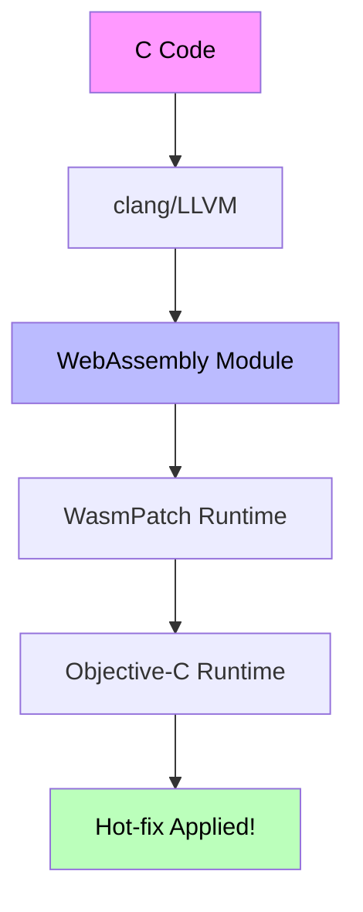

# WasmPatch 🧱

<div align="center">

[](https://github.com/everettjf/WasmPatch/stargazers)
[](https://github.com/everettjf/WasmPatch/network)
[](LICENSE)
[](https://github.com/everettjf/WasmPatch/issues)

**Yet Another Patch Module for iOS/macOS via WebAssembly**

[English](README.md) | [中文](README_CN.md)

</div>

> 💡 *Hot-fix iOS/macOS apps using WebAssembly payloads. Compile C code to WASM and replace Objective-C methods on the fly.*

---

## 🎯 What is WasmPatch?

WasmPatch bridges **Objective-C** and **WebAssembly**. It compiles C code into WebAssembly modules and lets those modules call any Objective-C class or method dynamically.

This gives apps the ability to:
- 🔧 **Hot-fix bugs** without shipping a new binary
- ✨ **Add features** via WebAssembly payloads
- 🔄 **Replace methods** at runtime (class and instance)


---

## ✨ Features

| Feature | Description |
|---------|-------------|
| 🧱 **WASM Compilation** | Compile C code to WebAssembly with `clang`/LLVM |
| 🔗 **Objective-C Bridge** | Call any Obj-C class or method from WebAssembly |
| 🔄 **Method Replacement** | Hot-fix by replacing Obj-C methods at runtime |
| 🍎 **Cross-Platform** | Works on both iOS and macOS |
| 🛠️ **Complete Tooling** | Ready-to-use scripts and sample projects |

---

## 🏗️ How It Works


```mermaid
graph TD
    A[C Code] --> B[clang/LLVM]
    B --> C[WebAssembly Module]
    C --> D[WasmPatch Runtime]
    D --> E[Objective-C Runtime]
    E --> F[Hot-fix Applied!]
    
    style A fill:#f9f,color:#000
    style C fill:#bbf,color:#000
    style F fill:#bfb,color:#000
```

1. **Write** your patch logic in C
2. **Compile** to WebAssembly using `clang`/LLVM
3. **Load** the wasm module in your app
4. **Call** Objective-C classes/methods from WebAssembly
5. **Replace** methods on the fly

---

## 🚀 Quick Start

### Prerequisites

```bash
# Install LLVM with WebAssembly target
brew install llvm

# Or use the provided script
sh Tool/install-llvm.sh
```

### 1. Clone and Setup

```bash
git clone https://github.com/everettjf/WasmPatch.git
cd WasmPatch
```

### 2. Compile a Patch

```bash
# Use the provided tool
sh Tool/c2wasm.sh your_patch.c -o your_patch.wasm
```

### 3. Load in Your App

```objc
# Import WasmPatch
#import <WasmPatch/WasmPatch.h>

// Load the WebAssembly module
BOOL success = [WasmPatch loadModuleFromPath:@"your_patch.wasm"];

// Apply patches
if (success) {
    [WasmPatch applyAllPatches];
}
```

---

## 📁 Project Structure

```
WasmPatch/
├── WasmPatch/              # Core framework
│   ├── WasmPatch.h         # Main header
│   ├── WasmRuntime.m       # WASM runtime
│   └── WasmBridge.m        # Obj-C bridge
├── Tool/                   # Build tools
│   ├── c2wasm.sh           # C to WASM compiler
│   └── install-llvm.sh     # LLVM installer
├── TestCase/               # Test cases
│   ├── compile-testcase.sh # Test compiler
│   └── wasm-test/          # Sample patches
├── Image/                  # Documentation images
├── Demo/                   # Demo projects
│   ├── iOS/               # iOS demo
│   └── macOS/             # macOS demo
└── README.md
```

---

## 💻 Examples

### Basic Method Replacement

```c
// my_patch.c
#include <wasmpatch.h>

// Hook a method and replace it
void hook_UIViewController_viewDidLoad() {
    NSLog(@"WasmPatch: viewDidLoad called!");
    // Your custom logic here
}
```

### Call Objective-C from WASM

```c
// advanced_patch.c
#include <wasmpatch.h>

void patch_network_request() {
    // Call any Objective-C method
    call_class_method("NetworkManager", "logRequest:", @"WasmPatch detected request");
    
    // Replace the implementation
    replace_method("NetworkManager", "sendRequest:",
                  (IMP)wasm_custom_send_request, NULL);
}
```

---

## 🛠️ Development

### Requirements

| Requirement | Version | Description |
|-------------|---------|-------------|
| **macOS** | 10.14+ | Development environment |
| **Xcode** | 11+ | iOS/macOS SDK |
| **LLVM/Clang** | 7.0+ | C to WASM compilation |
| **wasm2wat** | - | WASM tooling |

### Build

```bash
# Build the framework
cd WasmPatch/WasmPatch.xcodeproj
xcodebuild -project WasmPatch.xcodeproj \
  -scheme WasmPatch \
  -configuration Release \
  -sdk iphoneos build

# Build for macOS
xcodebuild -project WasmPatch.xcodeproj \
  -scheme WasmPatch \
  -configuration Release \
  -sdk macosx build
```

### Test

```bash
# Run test cases
cd TestCase
sh compile-testcase.sh

# Verify wasm modules
wasm2wat your_patch.wasm -o your_patch.wat
```

---

## 📱 Platform Support

| Platform | Support | Min Version |
|----------|---------|-------------|
| **iOS** | ✅ Full | 10.0 |
| **macOS** | ✅ Full | 10.14 |
| **Simulator** | ✅ Full | Same as above |

---

## 🧪 Test Cases

| Test Case | Description |
|-----------|-------------|
| `wasm-basic` | Basic WASM loading |
| `objc-bridge` | Objective-C method calls |
| `method-replace` | Method replacement |
| `memory-management` | Memory safety |

Run all tests:
```bash
sh TestCase/compile-testcase.sh
```

---

## 📚 Documentation

- [Architecture Overview](#-how-it-works)
- [API Reference](#-examples)
- [Tooling Guide](#-development)
- [Chinese Guide](http://weixin.qq.com/r/xxxxxxxx) - 微信文章

---

## 🤝 Contributing

Contributions are welcome! Areas to help:
- 🐛 Bug fixes
- ✨ New features
- 📝 Documentation
- 🧪 Test cases
- 💡 Performance improvements

---

## 📜 License

WasmPatch is released under the [MIT License](LICENSE).

---

## 🙏 Acknowledgements

Inspired by:
- [WebAssembly](https://webassembly.org/) - Binary format
- [Fishhook](https://github.com/facebookarchive/fishhook) - Symbol rebinding
- [JSPatch](https://github.com/bang590/JSPatch) - Hot-fix concept

---

## 📈 Star History

<div align="center">

[](https://star-history.com/#everettjf/WasmPatch&Date)

</div>

---

## 📞 Support

<div align="center">

[](https://github.com/everettjf/WasmPatch/issues)
[](Image/wechat.png)

**有问题？去 [Issues](https://github.com/everettjf/WasmPatch/issues) 提问！**

</div>

---

<div align="center">

**Made with ❤️ by [Everett](https://github.com/everettjf)**

**Project Link:** [https://github.com/everettjf/WasmPatch](https://github.com/everettjf/WasmPatch)

</div>
