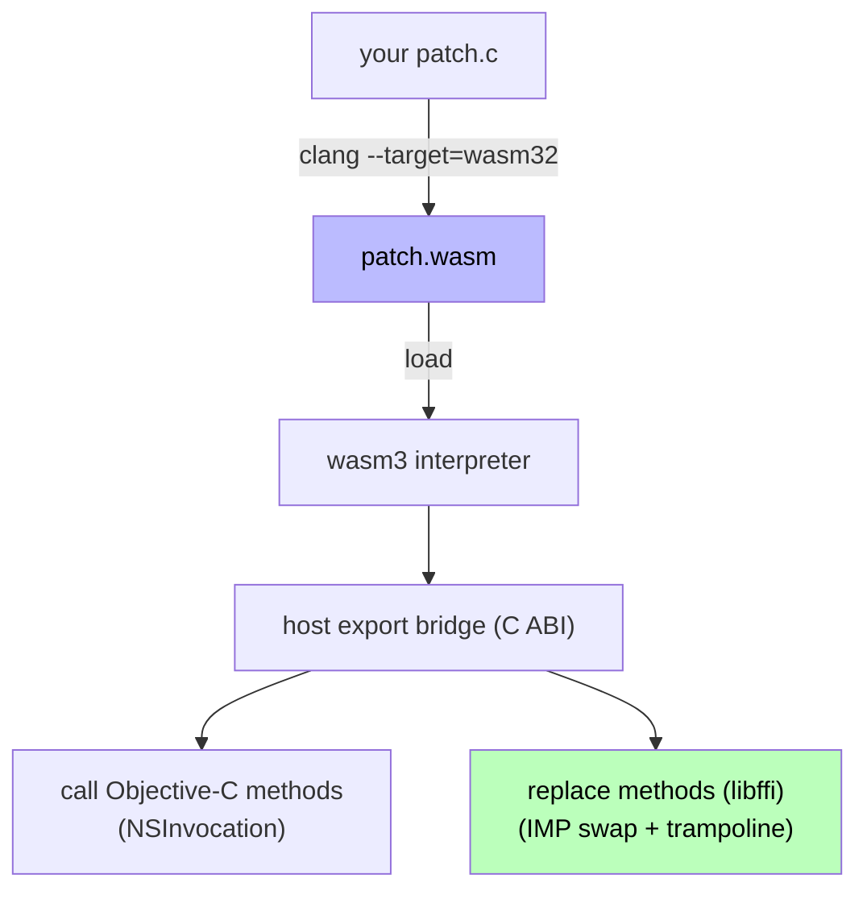

WasmPatch turns a small C file into a payload that can call into and rewrite a
running app. Four pieces make that work.

## The pipeline



1. **Compile.** `clang --target=wasm32` compiles your patch to a freestanding
   `.wasm` module (`-nostdlib`, `--no-entry`, `--allow-undefined`). The "undefined"
   symbols are the host functions WasmPatch provides — `new_objc_nsstring`,
   `call_class_method_1`, `replace_instance_method`, and so on.
2. **Load & run.** The host loads the module into a
   [wasm3](https://github.com/wasm3/wasm3) interpreter, links each host export,
   and calls the module's `entry()` once.
3. **Bridge.** Inside `entry()` your code calls the host exports. They translate
   between wasm values and the Objective-C runtime.
4. **Patch.** `replace_*` installs a libffi trampoline as the method's new
   implementation; calls from anywhere in the app now route through your wasm
   code. See [Method replacement](method-replacement.html).

## Why WebAssembly

The patch never executes as native machine code. It runs in an interpreter
whose only capabilities are the host functions WasmPatch chooses to export.
That makes the blast radius of a patch the *bridge surface*, not the whole
process — and it's portable across architectures (the same `.wasm` runs on
arm64 and x86_64). See the [Security model](security.html).

## The object model

Everything that crosses the bridge is an opaque `WAPObject` handle (a 64-bit
integer on the wasm side). Host-side it points to a small record describing a
bridged value — an `NSString`, an `NSNumber`, an Obj-C object, a struct, a
block. Patches never see raw pointers into the app; they hold handles and pass
them back to the bridge. See [The type bridge](type-bridging.html).

```c
WAPObject s = new_objc_nsstring("hi");      // a handle to an NSString
call_class_method_1("Logger", "log:", s);   // hand the handle back to the host
dealloc_object(s);                           // or use a WAP_POOL to batch cleanup
```

## The load lifecycle

`entry()` is the single entry point. It runs once, on load, on the calling
thread:

- **Register** replacements with `WAP_REPLACE_*`. Hooks installed here stay
  active for the lifetime of the runtime.
- **Call** any one-time setup (analytics ping, feature flip).

A replaced method's wasm body runs *later*, every time the app calls that
method. `WAPPatchLoader.reset()` (or `wap_reset_runtime()`) tears everything
down: it restores original implementations, frees libffi closures and created
blocks, and discards the interpreter. Loading again starts fresh.

## What the host provides

The bridge is organized into a handful of export groups:

| Group | Examples |
|-------|----------|
| Values | `alloc_int32/64`, `alloc_double`, `new_objc_nsstring`, `alloc_string` |
| Arrays | `alloc_array`, `append_array`, `get_array_item` |
| Calls | `call_class_method_0..4`, `call_instance_method_*`, `*_param` |
| Replacement | `replace_class_method`, `replace_instance_method` |
| Structs | `alloc_cgrect`, `alloc_struct`, `struct_get_*`/`set_*`, `struct_*_bits` |
| Blocks | `invoke_block`, `create_block` |

See [Authoring patches](../guides/authoring.html) for the practical API and
[The type bridge](type-bridging.html) for how values are marshalled.
